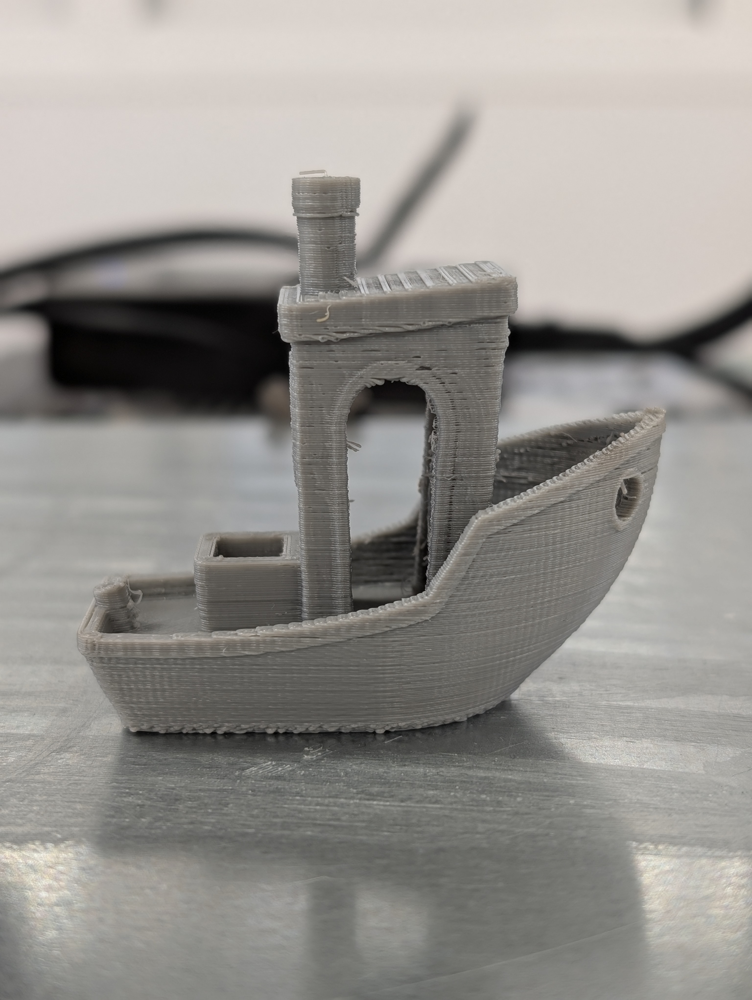
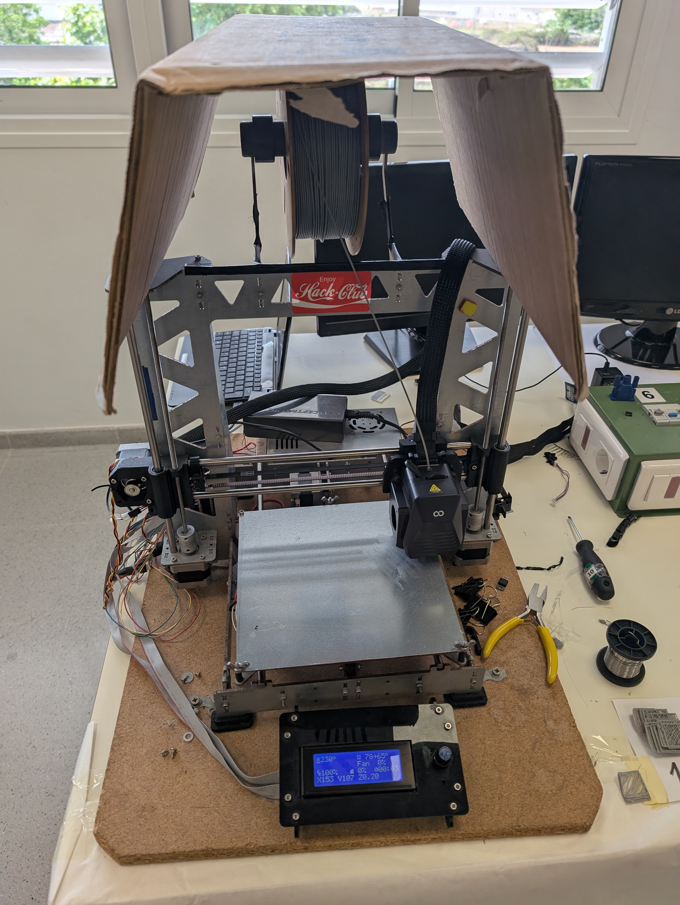

# PrusaI3-To-Elegoo
Mod for the Prusa i3 MK0 to support an Elegoo Neptune 4 printhead.
This was designed to be used with an old Prusa i3 MK0 that was found in my schools "museum", and I wanted to fix it and be able to use regular 1.75mm filament on it.
I also created a Klipper config for it, which can be found in the `Config` folder.

# Initial state
The printer was in a non-working state, with the original printhead being clogged with a broken needle (or something similar), the original firmware was not working, none of the motors were able to move, and the bed was not heating up.

# Modifications
- Removed the original printhead and replaced it with an Elegoo Neptune 4 printhead.
- Added a new mount for the printhead to fit the new printhead.
- Installed klipper using an old laptop as the klipper host.
- Custom steel plate added to the bed for better heat distribution and to allow for a magnetic bed.

# Final result
Benchy:

Total Printer

